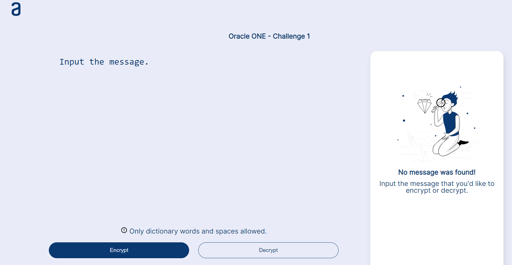
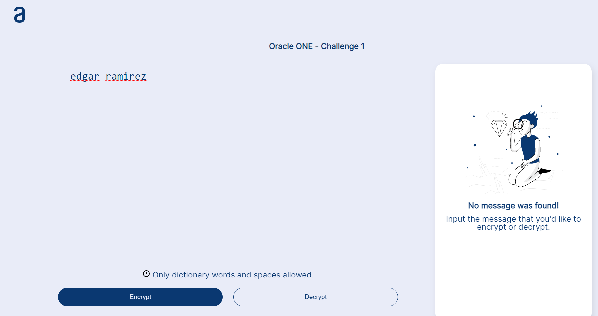
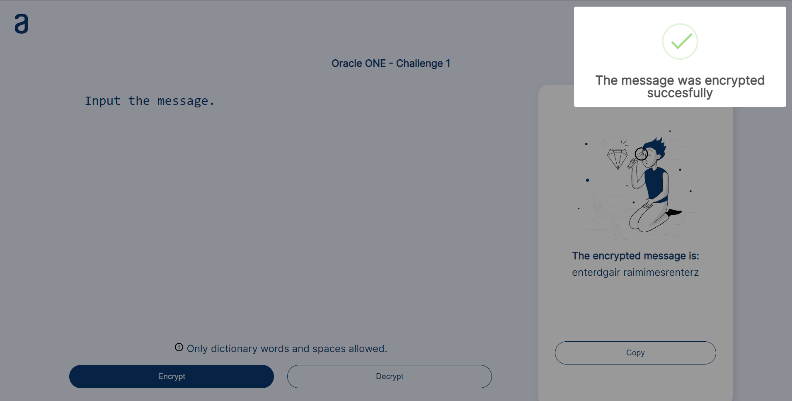
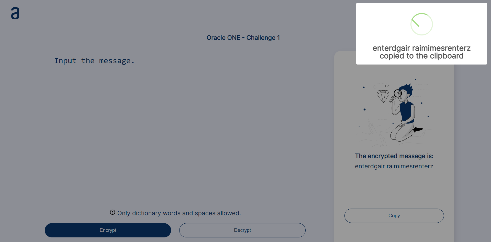
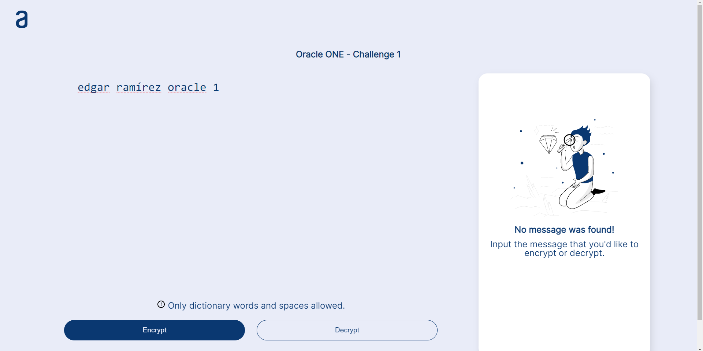
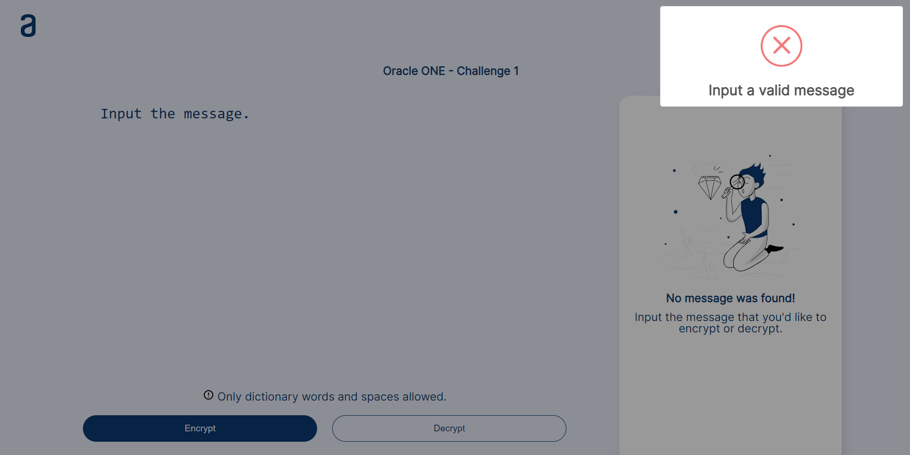
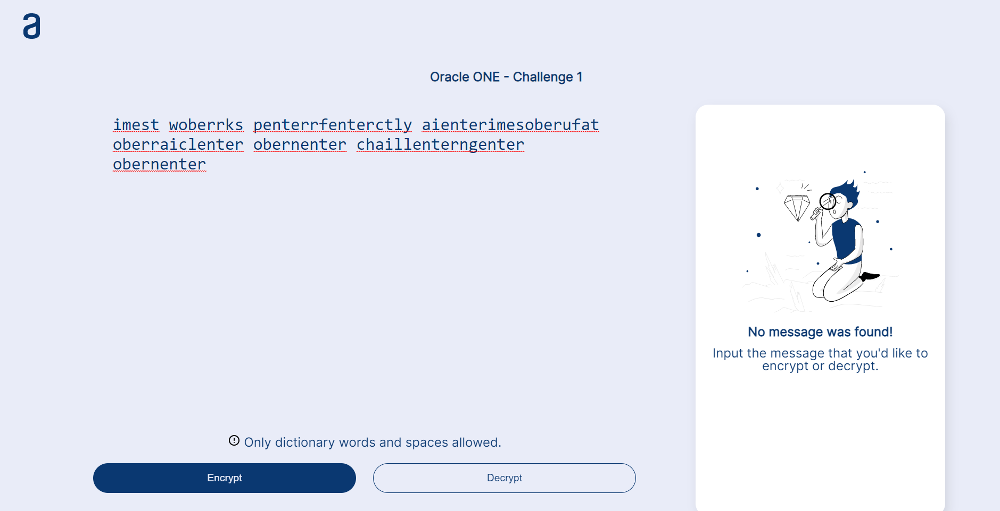
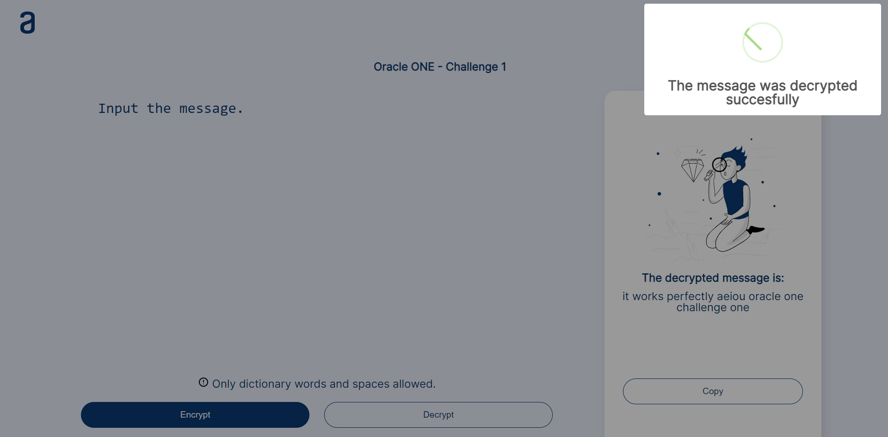
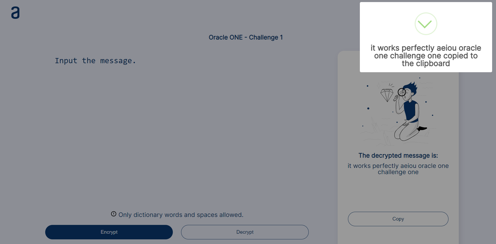

<p align="center">
  <a href="" rel="noopener">
 </a>
</p>

<h3 align="center">Oracle ONE Challenge 1</h3>

---

<p align="center"> 
  First challenge in the Oracle Next Education program called Text Cipher, which consists in develop a Text Cipher/Decipher using HTML, CSS, and JavaScript.
</p>

## 📝 Table of Contents

- [About](#about)
- [Getting Started](#getting_started)
- [Usage](#usage)
- [Built Using](#built_using)
- [Authors](#authors)

## 🧐 About <a name = "about"></a>

Welcome to our first challenge!

During these four weeks, we are going to work on an application that encrypts texts, so you can exchange secret messages with other people who know the secret of the encryption used.

The encryption "keys" that we will use are the following:

```
The letter "e" is converted to "enter"
The letter "i" is converted to "imes"
The letter "a" is converted to "ai"
The letter "o" is converted to "ober"
The letter "u" is converted to "ufat"
```

### Requirements:
- Should work only with lowercase letters
- Letters with accents or special characters should not be used
- It should be possible to convert a word to the encrypted version as well as return an encrypted word to its original version.

```
For example:  
"gato" => "gaitober"  
gaitober" => "gato"
```

- The page must have fields for
insertion of the text to be encrypted or decrypted, and the user must be able to choose between the two options.
- The result should be displayed on the screen.
Additional features:
- A button that copies the encrypted/decrypted text for the transfer section, that is, it has the same functionality as ctrl+C or the "copy" option from the applications menu.

We have a period of four weeks to develop the project and we are going to work with the agile development system.


## 🏁 Getting Started <a name = "getting_started"></a>

### Prerequisites
- Code editor or IDE
- Web Browser
- Git

## 🎈 Usage <a name="usage"></a>

### 🔒 Encryption

To encrypt a message, this must fulfill some requirements, such as:
- The message must only contain lowercase letters.
- The message must only contain english dictionary words.
- The message could contain spaces.

If the message fulfills all the requirements above, follow the next steps:

- Input/paste the message that you want to encrypt.




- Click on the __Encrypt__ button.



You can click on the __Copy__ button to copy the output in the clipboard.



If the message does not fulfills the requirements above, a message will be shown
and the message will not be encrypted.




### 🔓 Decryption

To decrypt a message follow the next steps:

- Input/paste the encrypted message.



- Click on the __Decrypt__ button.



You can click on the __Copy__ button to copy the output in the clipboard.



## 🚀 Deployment <a name = "deployment"></a>
The project was deployed using Netlify, you can check the project [here.](https://oracle-one-challenge-1.netlify.app/)

## ⛏️ Built Using <a name = "built_using"></a>

- [JavaScript](https://www.w3schools.com/JS/)
- [HTML](https://www.w3schools.com/html/)
- [CSS](https://www.w3schools.com/CSS/)

## ✍️ Authors <a name = "authors"></a>

- [EdgarRamirezFuentes](https://github.com/EdgarRamirezFuentes)

